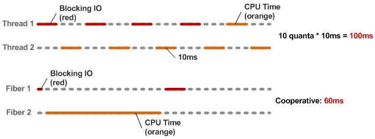

!SLIDE shout
# Asynchronous is&nbsp;hard #

!SLIDE
# Remember that example? #

```js
fs.open('results', 'w', function(err, fd) {
  fs.write(fd, results, function(err, written, f) {
    fs.close(fd, function(err) {
        done();
    });
  });
});
```

!SLIDE
# How to refactor it? #

Extract function and give them a name

!SLIDE
# How to refactor it? #

But, be warned, you will lose context!

In fact, harder to follow the flow

!SLIDE shout
# A magic solution #

!SLIDE
# Ruby 1.9 Fibers #

```ruby
fib = Fiber.new do
  x, y = 0, 1
  loop do
    Fiber.yield y
    x, y = y, x+y
  end
end
20.times { puts fib.resume }
```

!SLIDE
# Back to EventMachine #

```ruby
def async_fetch(url)
  f = Fiber.current
  http = EM::HttpRequest.new(url).get :timeout => 10
  http.callback { f.resume(http) }
  http.errback { f.resume(http) }
  return Fiber.yield
end
```

!SLIDE
# Back to EventMachine (2) #

```ruby
EM.run do
  Fiber.new do
    data = async_fetch('http://www.google.com/')
    puts "Fetched page: #{data.response_header.status}"
    EM.stop
  end.resume
end
```

!SLIDE
# Fibers vs Threads #


!SLIDE
# EM-Synchrony #

```ruby
EventMachine.synchrony do
  multi = EventMachine::Synchrony::Multi.new
  multi.add :a, EM::HttpRequest.new(url1).aget
  multi.add :b, EM::HttpRequest.new(url2).aget
  res = multi.perform
  p res
  EM.stop
end
```

!SLIDE shout
# Too magic to be true? #

!SLIDE
# Not perfect #

Each fiber has a stack of 4Kb

Don't use it with Rails for example

